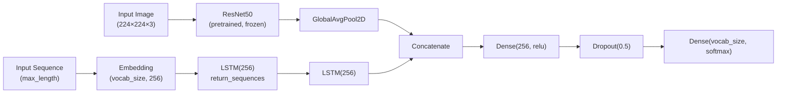
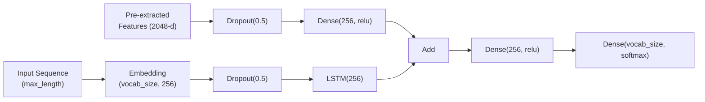
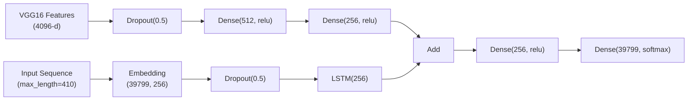

<p align="center">
  
</p>

# Image Captioning on Medical Images using Deep Learning

**Author:** Ajeet Kumar


---

## Table of Contents

- [Overview](#overview)
- [Problem Statement](#problem-statement)
- [Dataset](#dataset)
- [Project Structure](#project-structure)
- [Pipeline Workflow](#pipeline-workflow)
- [Model Architectures](#model-architectures)
- [Training Details](#training-details)
- [Evaluation Metrics & Results](#evaluation-metrics--results)
- [Dependencies](#dependencies)
- [Usage](#usage)
- [Future Scope](#future-scope)

- [Author](#author)

---

## Overview

This project implements an end-to-end **Image Captioning** system for **medical radiology images** using deep learning techniques. The system automatically generates meaningful, descriptive textual captions for input radiology images by combining **Computer Vision (CV)** and **Natural Language Processing (NLP)** approaches.

The core idea is to use a pre-trained **Convolutional Neural Network (CNN)** as an image encoder to extract visual features, and then feed those features into a **Long Short-Term Memory (LSTM)** recurrent neural network decoder that generates captions word-by-word. The project explores multiple model architectures — including **ResNet50**, **VGG16**, and custom CNN+LSTM variants — to find the best-performing configuration for medical image captioning.

The entire implementation is provided as a series of **Jupyter Notebooks** for easy experimentation, visualization, and reproducibility.

---

## Problem Statement

Radiology images (X-rays, CT scans, MRIs) are critical in clinical diagnosis, but interpreting them requires specialized expertise. Automatically generating accurate textual descriptions of these images can:

- **Assist radiologists** by providing preliminary caption suggestions, reducing workload.
- **Improve accessibility** for medical professionals who may not specialize in radiology.
- **Enable faster reporting** in high-volume clinical environments.
- **Support medical education** by providing descriptive annotations for training datasets.

This project tackles the challenge of bridging the gap between visual content in radiology images and their natural language descriptions using deep learning.

---

## Dataset

The project uses the **ROCO (Radiology Objects in COntext)** dataset, a large-scale, publicly available dataset specifically designed for medical image captioning and retrieval tasks.

### Dataset Statistics

| Split | Number of Captions |
|---|---|
| Training | 65,449 |
| Validation | 8,180 |
| **Total** | **73,629** |

### Key Properties

- **Image types:** Radiology images including X-rays, CT scans, MRI scans, ultrasound images, and other medical imaging modalities.
- **Caption format:** Each image is paired with one or more descriptive captions written by medical professionals.
- **Vocabulary size:** 39,799 unique words after preprocessing.
- **Max caption length:** 410 tokens (after tokenization).

For more information on the ROCO dataset, visit: [ROCO Dataset](https://github.com/razorx89/roco-dataset)

---

## Project Structure

```
Image-Captioning-using-Deep-Learning/
│
├── Data Preprocessing/
│   └── Image_Captioning(Medical_images)data_preprocessing.ipynb
│       → Data loading, text cleaning, image preprocessing
│
├── Model Training/
│   └── Medical_images_model_training.ipynb
│       → Model architecture definition, training pipeline
│
├── Model evaluation/
│   ├── Medical_Image_Captioning(Final) (1).ipynb
│   │   → CNN+LSTM model evaluation with Model 3
│   └── Medical_Image_Captioning(Final) (2).ipynb
│       → Extended evaluation with VGG16 features & greedy decoding
│
├── Final project/
│   └── Image_Captioning_On_Medical_Images(Final_Evaluation).ipynb
│       → Complete end-to-end pipeline (data → training → evaluation → inference)
│
├── Presentation and Documentation/
│   ├── Image_Captioning_Presentation.pptx    → Project presentation slides
│   └── InfosysSpringboard Internship 4.docx  → Internship documentation
│
├── image-captioning-banner.svg  → Project banner graphic
├── image-captioning-logo.svg    → Project logo

├── Image-Captioning-CONTRIBUTING.md → Contribution guidelines
├── Image-Captioning-SECURITY.md     → Security policy
└── README.md                    → This file
```

---

## Pipeline Workflow

The project follows a structured machine learning pipeline with four major stages:

### Stage 1: Data Preprocessing

1. **Load the ROCO dataset** — Read image paths and corresponding captions from the dataset files.
2. **Text cleaning** — Apply regex-based cleaning to remove special characters, convert to lowercase, and normalize whitespace. Use NLTK for tokenization.
3. **Image preprocessing** — Resize all images to **224×224 pixels**, convert grayscale images to 3-channel RGB, and normalize pixel values to the range [0, 1].
4. **Data splitting** — Split the dataset into training, validation, and test sets using `train_test_split` from scikit-learn.

### Stage 2: Feature Extraction

- Extract visual features from images using a **pre-trained CNN** (ResNet50 or VGG16) with ImageNet weights.
- The top classification layer is removed; global average pooling produces a fixed-size feature vector.
- **ResNet50** produces a **2048-dimensional** feature vector per image.
- **VGG16** produces a **4096-dimensional** feature vector per image (with an additional Dense layer).

### Stage 3: Model Training

- Tokenize captions using Keras `Tokenizer` and pad sequences to uniform length.
- Train the caption generator using a **data generator** that yields `([image_features, input_sequence], next_word)` pairs.
- Use teacher forcing during training: at each time step, the model receives the ground-truth previous word and predicts the next word.
- Apply **early stopping** and **model checkpointing** to prevent overfitting.

### Stage 4: Evaluation & Inference

- Generate captions for test images using **greedy decoding** — at each step, the word with the highest probability is selected.
- Evaluate generated captions against ground-truth using standard NLP metrics: **BLEU**, **ROUGE**, and **METEOR**.
- Visualize results by displaying radiology images alongside their generated and ground-truth captions.

---

## Model Architectures

Three model architectures were explored in this project:

### Model 1: ResNet50 + Dual LSTM (End-to-End)



- **Encoder:** ResNet50 (pre-trained on ImageNet, frozen weights) processes raw images end-to-end.
- **Decoder:** Two stacked LSTM layers (256 units each) process the text sequence.
- **Merge strategy:** Concatenation of image and text features.
- **Loss:** `sparse_categorical_crossentropy`

### Model 2: Feature-based CNN + LSTM (Merge-Add)



- **Encoder:** Pre-extracted 2048-d features from ResNet50 (computed offline).
- **Decoder:** Single LSTM layer (256 units) with masked embedding.
- **Merge strategy:** Element-wise addition of image and text features.
- **Loss:** `categorical_crossentropy`

### Model 3: VGG16 + Deep LSTM (Final Model) ⭐



- **Encoder:** VGG16 (pre-trained, frozen) + GlobalAvgPool2D + Dense(4096) for richer feature representation.
- **Decoder:** LSTM(256) with deeper dense layers (512 → 256) for gradual dimensionality reduction.
- **Merge strategy:** Element-wise addition.
- **Loss:** `categorical_crossentropy`
- **This is the final production model used for evaluation.**

---

## Training Details

| Hyperparameter | Value |
|---|---|
| **Optimizer** | Adam |
| **Loss Function** | Categorical Cross-Entropy |
| **Embedding Dimension** | 256 |
| **LSTM Units** | 256 |
| **Dropout Rate** | 0.5 |
| **Vocabulary Size** | 39,799 |
| **Max Caption Length** | 410 tokens |
| **Image Size** | 224 × 224 × 3 |
| **Batch Size** | 1 (teacher forcing with data generator) |
| **Callbacks** | EarlyStopping, ModelCheckpoint |

### Training Strategy

- **Transfer Learning:** CNN encoders (ResNet50/VGG16) are initialized with ImageNet weights and kept **frozen** during training — only the LSTM decoder and dense layers are trained.
- **Teacher Forcing:** During training, the model receives the ground-truth previous word at each time step to stabilize learning.
- **Data Generator:** A custom generator yields batches on-the-fly to handle the large dataset without loading everything into memory.

---

## Evaluation Metrics & Results

The generated captions are evaluated using three standard NLP metrics:

| Metric | Description | Score |
|---|---|---|
| **BLEU** | Measures n-gram precision between generated and reference captions | **0.65** |
| **ROUGE** | Measures recall-oriented overlap between generated and reference captions | **0.58** |
| **METEOR** | Considers synonymy, stemming, and word order in addition to exact matches | **0.60** |

### Metric Details

- **BLEU (Bilingual Evaluation Understudy):** Computes precision of n-gram overlaps (1-gram through 4-gram) between the generated caption and one or more reference captions. Scores range from 0 to 1, with 1 being a perfect match.

- **ROUGE (Recall-Oriented Understudy for Gisting Evaluation):** Originally designed for summarization, ROUGE measures the recall of n-grams from the reference in the generated caption. It captures how much of the reference content is preserved.

- **METEOR (Metric for Evaluation of Translation with Explicit ORdering):** Goes beyond exact word matching by incorporating stemming, synonymy (via WordNet), and word order. It correlates better with human judgment than BLEU alone.

---

## Dependencies

The following Python libraries are required to run this project:

```
tensorflow>=2.0
keras
numpy
pandas
matplotlib
opencv-python (cv2)
Pillow (PIL)
nltk
scikit-learn
tqdm
pickle (built-in)
jupyter
```

---

## Usage

### Running the Full Pipeline

Execute the notebooks in the following order for the complete pipeline:

1. **`Data Preprocessing/Image_Captioning(Medical_images)data_preprocessing.ipynb`**
   - Loads the ROCO dataset.
   - Cleans and tokenizes captions.
   - Preprocesses and resizes images.

2. **`Model Training/Medical_images_model_training.ipynb`**
   - Defines model architectures (Model 1, 2, and 3).
   - Trains the selected model on the preprocessed data.
   - Saves trained model weights.

3. **`Model evaluation/Medical_Image_Captioning(Final).ipynb`**
   - Loads the trained model.
   - Generates captions for test images using greedy decoding.
   - Computes BLEU, ROUGE, and METEOR scores.

4. **`Final project/Image_Captioning_On_Medical_Images(Final_Evaluation).ipynb`**
   - Runs the complete end-to-end pipeline in a single notebook.
   - Includes all steps from data loading to caption generation and evaluation.
   - Displays sample radiology images with their generated captions.

### Quick Inference

To generate a caption for a single image:

```python
# Load your trained model and tokenizer
from keras.models import load_model

model = load_model('models/model_best.h5')

# Extract features from a new image
features = extract_features('path/to/your/radiology_image.jpg')

# Generate caption
caption = generate_desc(model, tokenizer, features, max_length)
print(f"Generated Caption: {caption}")
```

---

## Future Scope

- **Attention Mechanism Enhancement:** Implement Bahdanau or Luong attention to allow the decoder to focus on relevant image regions while generating each word.
- **Transformer-based Models:** Replace the LSTM decoder with a Transformer decoder (e.g., GPT-2 or a medical-domain language model) for improved caption quality.
- **Beam Search Decoding:** Replace greedy decoding with beam search to explore multiple candidate captions and select the best one.
- **Larger Datasets:** Train on additional medical image captioning datasets (e.g., IU X-Ray, MIMIC-CXR) for improved generalization.
- **Web Application:** Build a Flask/Streamlit web interface for real-time medical image captioning.
- **Fine-tuning CNN Encoder:** Unfreeze some CNN layers and fine-tune them on medical images for domain-specific feature extraction.

---


## Author

**Ajeet Kumar**

This project demonstrates the application of deep learning techniques to the challenging task of medical image captioning, combining state-of-the-art computer vision and natural language processing methods.

---

<p align="center">
  
  <br/>
  <em>Generating meaningful descriptions for medical images through deep learning.</em>
</p>
